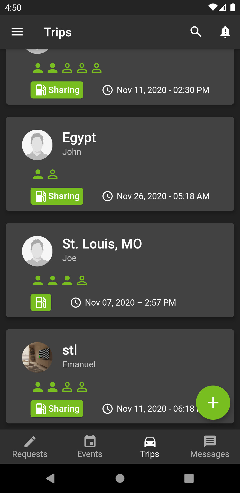
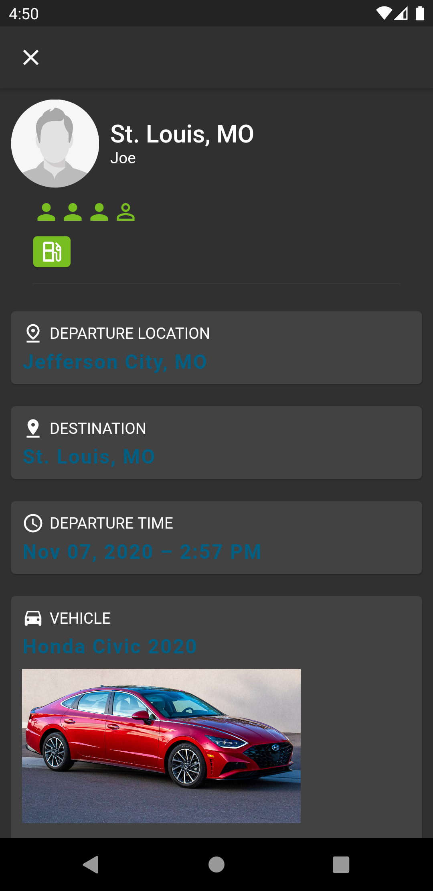

# Welcome To My Portfolio
### Kevin Ehlen

## Projects
- [Dynamic List](https://git.mst.edu/kse738/dynamiclist)
  - This is a program that creates a list that can be used for shopping. It has the ability to optimally split the items to get close to even pricing between two individuals. It takes advantage of vectors and min priority queues in c++ stl.
- [Databases Project](https://git.mst.edu/kse738/databases-project)
  - Electronic Devices Database and Website built with Php, Html, Css, MySQL, and some Javascript.
- Rideshare Application (Senior Design Project, Closed Source)
  - Built with Flutter/Dart and Firebase for Android, iOS, and web.
  

 
 
 

